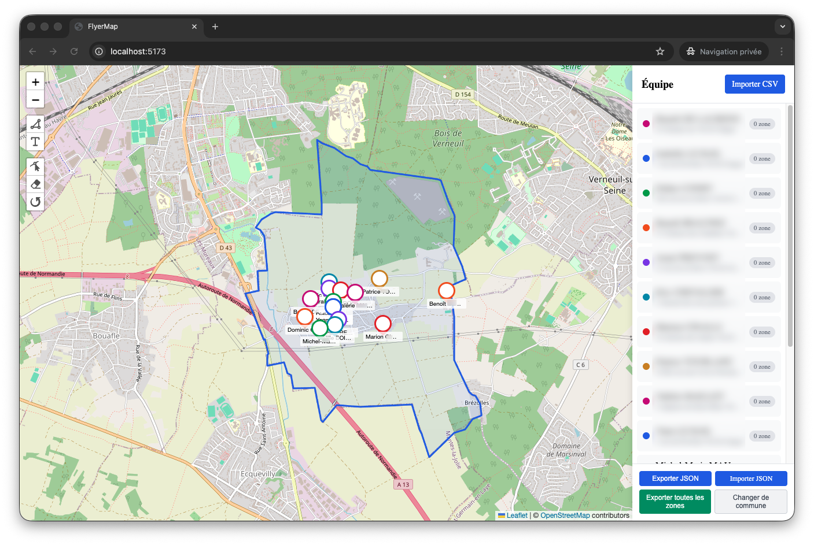
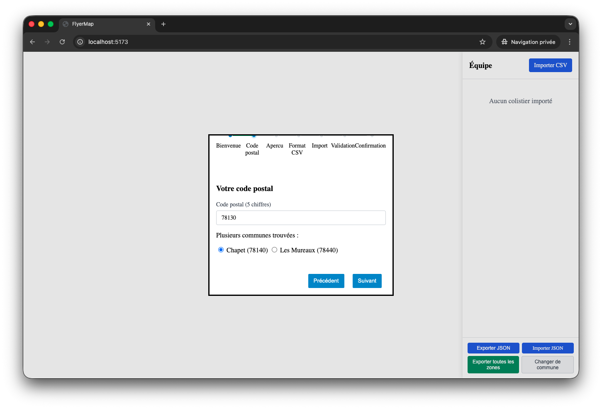
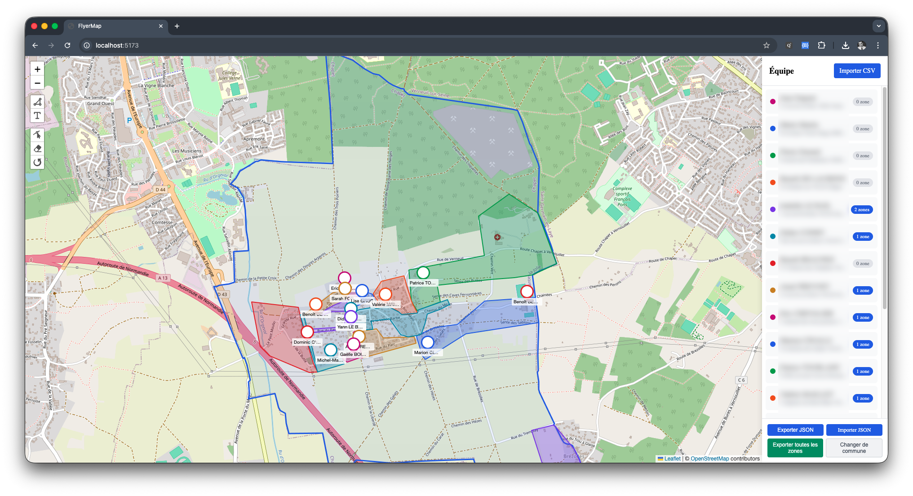
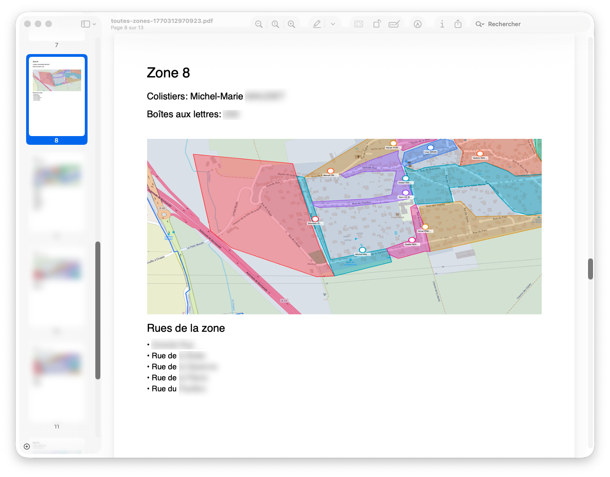

# FlyerMap

**Application ergonomique (mais sans prétention) de gestion cartographique pour la distribution de tracts électoraux.**



FlyerMap permet aux coordinateurs de campagne de visualiser et organiser la distribution de tracts sur une commune. L'application fonctionne entièrement en local (navigateur) sans serveur, garantissant la confidentialité des données personnelles (RGPD).

## Fonctionnalités

### Configuration initiale (Wizard)
- Sélection de la commune par code postal
- Import des colistiers via fichier CSV avec template à télécharger depuis l'application
- Géocodage automatique des adresses
- Aperçu du contour de la commune



### Gestion de l'équipe
- Visualisation des colistiers sur la carte avec marqueurs colorés
- Import/Export CSV des membres de l'équipe
- Affichage des informations (nom, adresse, téléphone)

### Zones de distribution
- Création de zones personnalisées par dessin sur la carte
- Estimation automatique du nombre de boîtes aux lettres via OpenStreetMap (à la création et modification)
- Attribution des colistiers aux zones
- Notes et métadonnées par zone



### Export
- **Export PDF par zone** : nom, colistiers assignés, carte, liste des rues OSM
- **Export CSV par zone** : données structurées avec rues OSM
- **Export PDF global** : toutes les zones en un seul document
- **Export/Import JSON** : sauvegarde complète des données



### Reconfiguration
- Changement de commune avec confirmation
- Réinitialisation des données

## Installation

```bash
# Cloner le dépôt
git clone https://github.com/mmaudet/flyermap.git
cd flyermap

# Installer les dépendances
npm install

# Lancer en développement
npm run dev

# Build de production
npm run build
```

## Technologies

- **Leaflet** : cartographie interactive
- **Leaflet-Geoman** : dessin de zones
- **jsPDF** : génération de PDF
- **PapaParse** : parsing CSV
- **Wizard-JS** : assistant de configuration
- **Vite** : bundler moderne

## APIs utilisées

- **[geo.api.gouv.fr](https://geo.api.gouv.fr/)** : recherche de communes par code postal
- **[data.geopf.fr](https://data.geopf.fr/)** : géocodage des adresses françaises
- **[Overpass API](https://overpass-api.de/)** : données OpenStreetMap (bâtiments, rues)
- **[OpenStreetMap](https://www.openstreetmap.org/)** : tuiles cartographiques

## FAQ

### À quelles questions FlyerMap répond-il ?

- **Qui distribue où ?** — Visualisez les zones assignées à chaque colistier
- **Combien de boîtes aux lettres dans ma zone ?** — Estimation automatique via OSM dès la création de la zone
- **Quelles rues couvrir ?** — Liste des rues par zone depuis OpenStreetMap
- **Comment partager les affectations ?** — Export PDF imprimable par zone

### Les données sont-elles sécurisées ?

Oui. Toutes les données sont stockées **uniquement dans votre navigateur** (localStorage). Aucune donnée n'est envoyée à un serveur. Les seules requêtes réseau sont vers des APIs publiques (géocodage, OSM) et ne contiennent pas de données personnelles identifiantes.

### Puis-je utiliser FlyerMap pour une autre commune ?

Oui. Utilisez le bouton "Changer de commune" pour réinitialiser et sélectionner une nouvelle commune. Attention : cette action supprime les données existantes.

### Le géocodage échoue pour certaines adresses, pourquoi ?

L'API de géocodage peut parfois être surchargée (erreur 504). FlyerMap réessaie automatiquement jusqu'à 3 fois. Si l'adresse n'est toujours pas trouvée, vous pouvez l'ajouter manuellement plus tard.

### Comment sauvegarder mes données ?

Utilisez "Exporter JSON" pour télécharger une sauvegarde complète. Vous pourrez la restaurer avec "Importer JSON" sur n'importe quel navigateur.

## Structure du projet

```
flyermap/
├── src/
│   ├── main.js              # Point d'entrée
│   ├── style.css            # Styles globaux
│   ├── data/                # Gestion des données
│   ├── map/                 # Composants cartographiques
│   ├── services/            # APIs externes (geocoding, overpass)
│   ├── state/               # Store centralisé
│   ├── ui/                  # Composants interface
│   └── utils/               # Utilitaires
├── public/
│   └── templates/           # Modèles CSV
└── index.html
```

## Contribution

Les contributions sont les bienvenues ! Consultez [CONTRIBUTING.md](CONTRIBUTING.md) pour les directives.

## Licence

Ce projet est sous licence **GNU Affero General Public License v3.0** (AGPL-3.0).

Voir le fichier [LICENSE](LICENSE) pour plus de détails.

## Auteur

Développement bénévole par Michel-Marie MAUDET ([michel.maudet@protonmail.com](mailto:michel.maudet@protonmail.com)) pour la liste [Vivons Chapet](https://www.vivons-chapet.fr/) pour les élections municipales du 15 et 22 mars 2026 à Chapet (78130).

---

*FlyerMap — Organisez votre distribution de tracts efficacement*
